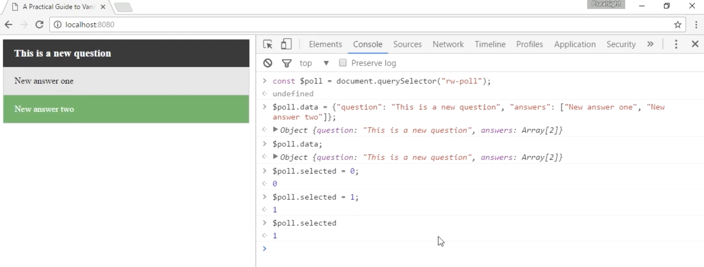

# **Web Component Properties**

- Using attributes to provide data to your component, it's perfect for simple data, but ultimately attribute value values can only be strings and therefore attributes are not suitable for more complex data like objects and arrays.

## **In this demo:**

We'll build a poll work component which represents the question the user and allows them to choose a single answer. Before we get started, we'll quickly walk you through how this components works. In the constructor, we'll declare a few private variables and set some initial data to display.
In the connectedcallback, we first will set
the attached variable to true so we know when the element has been added to the DOM, then I add the component template and store some references to the important elements. I've added an event listener to the answers list so when a user clicks an answer, it will find the index storing it in a private variable and also adds the selector class to mark the chosen answer as green. The last thing in the connectedcallback is calling the render method which updates the component template for the data in the data variable.
Currently, this component is just displaying some static data which in practice is pretty useless. How can we create an API so someone using this component in their app can not only provide it with a new question and answers but also, programmatically select the selected answer. This is were properties come in.
First and foremost we want it to be possible to dynamically add a question and a set of answers so we'll remove the static data.

- We'll see how to create an API four our components using properties.
- We'll describe the difference between properties and attributes.
- We'll demostrate how we can allow data to be pushed into our component (This means, using setter methods to retrieve data).
- And to how getter methods can be used to allow data inside your components to be retrieved externally (Using getter methods to provide data).

:)
